# Ansible Rulebook IDE - Complete Architecture

## Overview Diagram

```mermaid
graph TB
    subgraph "Frontend (React + TypeScript)"
        UI[User Interface]
        RE[RulesetEditor]
        RLE[RuleEditor]
        AE[ActionEditor]
        SE[SourceEditor]
        ME[Monaco Editor]
        JE[JSON Editor]

        UI --> RE
        UI --> RLE
        UI --> AE
        UI --> SE
        RE --> ME
        SE --> JE
    end

    subgraph "Backend Server (Express + Node.js)"
        WS[WebSocket Server]
        PM[Process Manager]
        TM[Tunnel Manager]
        WH[Webhook Handler]

        WS --> PM
        WS --> TM
        WH --> WS
    end

    subgraph "External Services"
        AR[Ansible Rulebook Process]
        NG[ngrok Service]

        AR -.->|stdout/stderr| PM
    end

    subgraph "External Events"
        EXT[External Webhooks]
    end

    UI <-->|WebSocket Messages| WS
    PM -->|Spawn/Monitor| AR
    TM <-->|Create Tunnel| NG
    EXT -->|HTTP POST| NG
    NG -->|Forward| WH
    WH -->|Relay Events| AR
    AR -.->|WebSocket Events| WS

    style UI fill:#61dafb
    style WS fill:#68a063
    style AR fill:#ee0000
    style NG fill:#1f1e37
```



## Component Interactions

### 1. Startup Flow

```
┌─────────┐     ┌──────────────┐     ┌────────────────┐
│  User   │────▶│  npm run dev │────▶│  Unified       │
│         │     │              │     │  Server Starts │
└─────────┘     └──────────────┘     └────────────────┘
                                              │
                                              ▼
                          ┌───────────────────────────────────┐
                          │  1. Express HTTP server           │
                          │  2. Vite middleware (dev mode)    │
                          │  3. WebSocket server attached     │
                          │  4. Listen on port 5555           │
                          └───────────────────────────────────┘
                                              │
                                              ▼
                          ┌───────────────────────────────────┐
                          │  Browser: http://localhost:5555   │
                          │  React app loads                  │
                          │  WebSocket auto-connects          │
                          └───────────────────────────────────┘
```

### 2. Execution Flow

```
┌──────────────┐  start_execution   ┌──────────────┐  spawn  ┌─────────────────┐
│   React UI   │───────────────────▶│   Unified    │────────▶│  ansible-       │
│              │     (WebSocket)    │   Server     │         │  rulebook       │
└──────────────┘                    └──────────────┘         └─────────────────┘
       │                                    │                         │
       │                                    │ send rulebook+vars      │
       │                                    │ (WebSocket)             │
       │                                    ├────────────────────────▶│
       │                                    │                         │
       │                                    │◀────────────────────────┤
       │                                    │   Worker registration   │
       │                                    │                         │
       │  rulebook_event                   │   Events (Job, Action)  │
       │◀───────────────────────────────────┤◀────────────────────────┤
       │  (broadcasted)                     │   (WebSocket)           │
       │                                    │                         │
       │  UI highlights triggered rules     │                         │
       │                                    │                         │
```

### 3. Cloud Tunnel + Webhook Flow

```
┌──────────┐  create_tunnel    ┌──────────────┐   ngrok.forward()   ┌────────────┐
│ React UI │──────────────────▶│   Unified    │────────────────────▶│   Ngrok    │
│          │   (WebSocket)     │   Server     │                     │   Service  │
└──────────┘                   └──────────────┘                     └────────────┘
                                       │                                   │
                                       │ Creates:                          │
                                       │ 1. HTTP intercept server          │
                                       │    on tunnel port                 │
                                       │ 2. Ngrok tunnel                   │
                                       │                                   │
                                       ▼                                   │
                            ┌────────────────────┐                        │
                            │ Intercept Server   │                        │
                            │ Port: 8080         │◀───────────────────────┘
                            └────────────────────┘  Tunnel forwards here
                                       │
                                       │ Webhook arrives
                                       ▼
                        ┌──────────────────────────────┐
                        │  1. Log webhook              │
                        │  2. Broadcast to UI          │
                        │     (tunnel_webhook_received)│
                        │  3. Display in JSON Explorer │
                        │  4. IF forwarding enabled:   │
                        └──────────────────────────────┘
                                       │
                                       │ Forward
                                       ▼
                        ┌──────────────────────────────┐
                        │  ansible-rulebook webhook    │
                        │  source on port 5643         │
                        │                              │
                        │  Processes webhook           │
                        │  Triggers rules              │
                        │  Executes actions            │
                        └──────────────────────────────┘
```

### 4. Detailed Webhook Forwarding

```
External Service (GitHub)
         │
         │ POST https://xyz123.ngrok.io/endpoint
         ▼
    Ngrok Cloud
         │
         │ Forwards to localhost:8080
         ▼
Intercept HTTP Server (Port 8080)
         │
         ├─────────────────────────────────────┐
         │                                     │
         │ Broadcast                           │ Forward (if enabled)
         ▼                                     ▼
  WebSocket Server              POST localhost:5643/endpoint
         │                                     │
         │ tunnel_webhook_received             ▼
         ▼                          ansible-rulebook webhook source
    React UI                                   │
         │                                     │ Event triggers
    JSON Path Explorer                         ▼
    displays webhook                    Rule evaluation
                                               │
                                               ▼
                                        Action execution
                                               │
                                               ▼
                                        Events sent via WS
                                               │
                                               ▼
                                          React UI
                                    (rules highlighted)
```

## Key Features

### Single Port Architecture
- **Port 5555** handles everything:
  - HTTP requests (Vite dev server or static files)
  - WebSocket connections (UI and ansible-rulebook workers)
  - Single origin - no CORS issues

### WebSocket Message Types

**From UI → Server:**
- `register_ui` - Register UI client
- `start_execution` - Start ansible-rulebook
- `stop_execution` - Stop running execution
- `create_tunnel` - Create ngrok tunnel with optional forwarding
- `delete_tunnel` - Delete ngrok tunnel
- `test_tunnel` - Send test webhook
- `send_webhook` - Proxy webhook to local port
- `get_ansible_version` - Get version info
- `heartbeat` - Keep connection alive

**From ansible-rulebook → Server:**
- `Worker` - Register worker connection
- `Job` - Job started/completed
- `AnsibleEvent` - Events from Ansible
- `ProcessedEvent` - Event processed by rule
- `Action` - Action executed
- `Shutdown` - Worker shutting down
- `SessionStats` - Heartbeat with stats

**From Server → UI:**
- `registered` - Registration confirmed
- `execution_started` - Execution started
- `execution_stopped` - Execution stopped
- `worker_connected` - Worker registered
- `rulebook_event` - Event from ansible-rulebook
- `session_stats` - Stats from worker
- `tunnel_created` - Tunnel created
- `tunnel_deleted` - Tunnel deleted
- `tunnel_webhook_received` - Webhook intercepted
- `process_output` - stdout/stderr from ansible-rulebook
- `process_error` - Process error
- `process_exited` - Process exited
- `ansible_version_response` - Version info

### Tunnel Forwarding Options

1. **No Forwarding:**
   - Intercept server receives webhook
   - Broadcasts to UI for inspection
   - Returns 200 OK
   - Use case: Testing webhook payloads

2. **With Forwarding:**
   - Intercept server receives webhook
   - Broadcasts to UI for inspection
   - Forwards to ansible-rulebook webhook source
   - Returns ansible-rulebook's response
   - Use case: Production-like testing

## File Structure

```
rulebook-ide/
├── server/
│   └── server.js              # Unified Express + WebSocket server
├── src/
│   ├── components/
│   │   ├── VisualEditor.tsx   # Main editor + execution controls
│   │   ├── JsonPathExplorer.tsx  # Webhook payload viewer
│   │   ├── CloudTunnels.tsx   # Tunnel management UI
│   │   └── ...
│   ├── App.tsx                # Root component
│   └── main.tsx               # Entry point
├── dist/                      # Production build (after npm run build)
├── package.json               # Scripts and dependencies
└── README.md                  # User documentation
```

## Environment Variables

- `PORT` - Server port (default: 5555)
- `NODE_ENV` - `production` or `development`
- `ANSIBLE_RULEBOOK_PATH` - Path to ansible-rulebook executable

## Development vs Production

### Development Mode (`npm run dev`)
- Vite middleware provides HMR
- Source maps enabled
- Fast refresh for React components
- Detailed logging

### Production Mode (`npm run build && npm start`)
- Static files served from `dist/`
- Optimized bundles
- Minified assets
- Production logging

## Benefits of Unified Architecture

✅ **Single Command** - `npm run dev` starts everything
✅ **Single Port** - No port conflicts or confusion
✅ **No CORS** - Same origin for frontend and backend
✅ **Simplified** - One process to manage
✅ **Better DX** - Immediate feedback, HMR works perfectly
✅ **Production Ready** - Same architecture for dev and prod
