# Rulebook IDE Architecture Diagram

```mermaid
graph TB
    subgraph "Frontend (React + TypeScript)"
        UI[User Interface]
        RE[RulesetEditor]
        RLE[RuleEditor]
        AE[ActionEditor]
        SE[SourceEditor]
        ME[Monaco Editor]
        JE[JSON Editor]

        UI --> RE
        UI --> RLE
        UI --> AE
        UI --> SE
        RE --> ME
        SE --> JE
    end

    subgraph "Backend Server (Express + Node.js)"
        WS[WebSocket Server]
        PM[Process Manager]
        TM[Tunnel Manager]
        WH[Webhook Handler]

        WS --> PM
        WS --> TM
        WH --> WS
    end

    subgraph "External Services"
        AR[Ansible Rulebook Process]
        NG[ngrok Service]

        AR -.->|stdout/stderr| PM
    end

    subgraph "External Events"
        EXT[External Webhooks]
    end

    UI <-->|WebSocket Messages| WS
    PM -->|Spawn/Monitor| AR
    TM <-->|Create Tunnel| NG
    EXT -->|HTTP POST| NG
    NG -->|Forward| WH
    WH -->|Relay Events| AR
    AR -.->|WebSocket Events| WS

    style UI fill:#61dafb
    style WS fill:#68a063
    style AR fill:#ee0000
    style NG fill:#1f1e37
```

## Overview

This diagram shows the architecture of the Rulebook IDE, a web-based development environment for creating and managing Ansible Rulebooks.

### Key Components

**Frontend (React + TypeScript)**

- Visual editors for rulesets, rules, actions, and event sources
- Monaco Editor for YAML editing
- JSON Editor for source configuration

**Backend Server (Express + Node.js)**

- WebSocket Server for real-time bidirectional communication
- Process Manager for Ansible Rulebook lifecycle management
- Tunnel Manager for ngrok tunnel creation and management
- Webhook Handler for forwarding external webhooks

**External Services**

- Ansible Rulebook running as a separate process
- ngrok for creating cloud tunnels to receive webhooks

### Data Flow

1. User interacts with React frontend
2. WebSocket messages sent to backend server
3. Backend spawns and monitors Ansible Rulebook process
4. External webhooks route through ngrok tunnels
5. Webhooks forwarded to Ansible Rulebook
6. Real-time events stream back through WebSocket to frontend

### Dual WebSocket Architecture

**Important:** The system uses **two separate WebSocket connections**:

1. **WebSocket #1 (Worker):** `ansible-rulebook` ↔ Server
   - Worker registration and events
   - Job, Action, ProcessedEvent messages
   - SessionStats heartbeats

2. **WebSocket #2 (UI):** Server ↔ Browser UI
   - Transformed and wrapped events
   - Process output (stdout/stderr)
   - Execution control messages

**The server acts as an intelligent intermediary:**

- Does NOT directly forward worker messages to UI
- Wraps events in `rulebook_event` envelope
- Adds metadata (executionId, timestamps)
- Broadcasts to multiple UI clients
- Maintains event history

For detailed documentation on the dual WebSocket architecture, see [ARCHITECTURE.md - Dual WebSocket Architecture](./ARCHITECTURE.md#dual-websocket-architecture)
