# Cloud Tunnel Architecture with Ngrok

## Overview

The Cloud Tunnel feature uses ngrok to expose local webhook ports to the internet, enabling external systems to send webhooks for testing while providing real-time inspection and optional forwarding to ansible-rulebook.


## Architecture Diagram

```mermaid
flowchart TB
    subgraph External["🌐 External Systems"]
        WebhookSrc["External Webhook Source<br/>(GitHub, GitLab, Jenkins, etc.)"]
    end

    subgraph NgrokCloud["☁️ Ngrok Cloud"]
        PublicURL["Public HTTPS URL<br/>https://abc123.ngrok.io"]
    end

    subgraph LocalMachine["💻 Local Machine (localhost)"]
        subgraph Server["Node.js WebSocket Server"]
            NgrokTunnel["Ngrok Tunnel Listener<br/>Port: 5556"]
            TunnelManager["Tunnel Manager<br/>- Create/Delete Tunnels<br/>- Forward Configuration<br/>- Webhook Interception"]
        end

        subgraph RulebookIDE["Rulebook IDE Frontend"]
            JsonExplorer["JSON Path Explorer<br/>- Inspect Payload<br/>- Copy JSONPath<br/>- Test Conditions"]
            EventLog["Event Log<br/>- View Webhooks<br/>- Track Forwarding"]
        end

        subgraph Rulebook["Ansible Rulebook"]
            WebhookSource["Webhook Source<br/>Port: 5000"]
            RuleEngine["Rule Engine<br/>- Match Conditions<br/>- Trigger Actions"]
        end
    end

    WebhookSrc -->|"POST /endpoint<br/>{payload}"| PublicURL
    PublicURL -->|"Secure Tunnel"| NgrokTunnel

    NgrokTunnel -->|"1. Intercept"| TunnelManager
    TunnelManager -->|"2a. Display"| JsonExplorer
    TunnelManager -->|"2b. Log"| EventLog
    TunnelManager -->|"3. Forward (optional)"| WebhookSource
    WebhookSource -->|"4. Process"| RuleEngine

    style WebhookSrc fill:#e1f5ff
    style PublicURL fill:#fff4e1
    style NgrokTunnel fill:#e8f5e9
    style JsonExplorer fill:#f3e5f5
    style WebhookSource fill:#fff3e0
    style RuleEngine fill:#e0f2f1
```



## Data Flow Sequence


## Component Details

### 1. External Webhook Source
- **Purpose**: Any external system that sends HTTP POST webhooks
- **Examples**: GitHub Actions, GitLab CI/CD, Jenkins, monitoring systems
- **Format**: Standard JSON payloads over HTTPS

### 2. Ngrok Cloud Tunnel
- **Purpose**: Secure proxy that exposes local ports to the internet
- **Features**:
  - HTTPS termination (automatic TLS)
  - Stable public URL during tunnel lifetime
  - Request inspection and replay
  - Regional endpoints
- **Authentication**: Requires ngrok API token (configured in Settings)

### 3. Tunnel Listener
- **Port**: User-configurable (default: 5556)
- **Protocol**: HTTP/HTTPS
- **Endpoint**: `/endpoint` (standard webhook receiver)
- **Function**: Receives all incoming webhooks from ngrok

### 4. Tunnel Manager (WebSocket Server)
- **Responsibilities**:
  - Create/delete ngrok tunnels via API
  - Intercept all incoming webhooks
  - Parse and validate JSON payloads
  - Send payloads to UI via WebSocket
  - Optionally forward to ansible-rulebook webhook source
  - Track tunnel state and forwarding configuration

### 5. JSON Path Explorer (Frontend)
- **Purpose**: Interactive payload inspection
- **Features**:
  - Pretty-printed JSON with syntax highlighting
  - Expandable/collapsible tree view
  - Click to copy JSONPath expressions
  - Test condition expressions in real-time
  - Auto-open on webhook receipt (configurable)
- **JSONPath Prefix**: `event` or `event.payload` (user-configurable)

### 6. Event Log
- **Purpose**: Real-time webhook activity monitoring
- **Displays**:
  - Webhook received timestamp
  - HTTP method and URL
  - Forwarding status
  - Success/error messages
  - Test tunnel results

### 7. Webhook Source (Ansible Rulebook)
- **Port**: Defined in rulebook source configuration
- **Source Types**:
  - `ansible.eda.webhook` (legacy)
  - `eda.builtin.webhook` (new format)
- **Function**: Receives events and feeds them to rule engine

### 8. Rule Engine
- **Purpose**: Match events against rule conditions
- **Process**:
  1. Receive event from webhook source
  2. Evaluate conditions using pattern matching
  3. Trigger actions when conditions match
  4. Report back to UI via WebSocket

## Operating Modes

### Mode 1: Inspection Only (Forwarding Disabled)
```
External → Ngrok → Tunnel → Manager → JSON Explorer + Event Log
                                     ↓
                                (No forwarding)
```
**Use Case**: Analyze webhook payloads from external systems before writing rules

**Benefits**:
- Safe payload inspection without affecting rulebook
- Iterate on condition expressions using real data
- Debug webhook format issues

### Mode 2: Inspection + Forwarding (Forwarding Enabled)
```
External → Ngrok → Tunnel → Manager → JSON Explorer + Event Log
                                     ↓
                                  Forward
                                     ↓
                            Webhook Source → Rule Engine
```
**Use Case**: Test complete end-to-end flow with external webhooks

**Benefits**:
- Full integration testing
- Real-world event processing
- Rule validation with production-like data

## Configuration

### Ngrok API Token
- **Location**: Settings → Ngrok API Token
- **Required**: Yes (for creating tunnels)
- **Obtain**: Sign up at https://ngrok.com and generate token
- **Storage**: Saved in localStorage (not transmitted)

### Tunnel Port
- **Location**: Cloud Tunnel modal → Local Port
- **Default**: 5556
- **Range**: 1024-65535
- **Purpose**: Local port that ngrok forwards to

### Webhook Forwarding
- **Configuration**: Enabled/disabled per tunnel
- **Target**: Select from detected webhook sources in rulebook
- **When to Enable**:
  - Testing with real external webhooks
  - End-to-end flow validation
- **When to Disable**:
  - Initial payload exploration
  - Debugging condition syntax
  - Preventing rule execution during testing

### JSONPath Prefix
- **Location**: Settings → JSON Path Prefix
- **Options**:
  - `event` - For conditions like `event.user.name`
  - `event.payload` - For conditions like `event.payload.user.name`
- **Purpose**: Determines the root path when copying from JSON Explorer

## Security Considerations

### ✅ Secure Features
- **HTTPS**: All ngrok tunnels use TLS encryption
- **Token-based**: Ngrok API token required (not shared)
- **Local-only**: Tunnel manager runs on localhost
- **Temporary**: Tunnels only exist while modal is open
- **Controlled**: User explicitly creates/deletes tunnels

### ⚠️ Security Best Practices
- **Don't share tunnel URLs**: Public URLs are accessible to anyone
- **Delete after testing**: Always delete tunnels when done
- **Use authentication**: Configure webhook signature validation in rules
- **Monitor Event Log**: Watch for unexpected webhook traffic
- **Rotate tokens**: Regenerate ngrok API token periodically

## Workflow Examples

### Example 1: Testing GitHub Webhook

1. **Setup**:
   - Configure ngrok API token in Settings
   - Add webhook source to rulebook: `ansible.eda.webhook` on port 5000
   - Create rule with condition: `event.action == "opened"`

2. **Create Tunnel**:
   - Open Cloud Tunnel modal
   - Set port to 5556
   - Enable forwarding to port 5000
   - Click "Create Tunnel"
   - Copy public URL: `https://abc123.ngrok.io`

3. **Configure GitHub**:
   - Go to GitHub repository → Settings → Webhooks
   - Add webhook with URL: `https://abc123.ngrok.io/endpoint`
   - Select events: Pull Requests
   - Save webhook

4. **Test**:
   - Open a pull request in GitHub
   - Watch Event Log for incoming webhook
   - JSON Explorer opens with GitHub payload
   - Verify forwarding to rulebook
   - Check if rule triggers

5. **Cleanup**:
   - Delete tunnel in Cloud Tunnel modal
   - Remove GitHub webhook (or keep for future use)

### Example 2: Exploring API Payloads

1. **Setup**:
   - Configure ngrok API token
   - Create tunnel on port 5556
   - **Disable forwarding** (inspection only)

2. **Send Test Webhook**:
   - Click "Send Test Payload" button
   - Or use curl:
     ```bash
     curl -X POST https://abc123.ngrok.io/endpoint \
       -H "Content-Type: application/json" \
       -d '{"user": {"name": "Alice", "role": "admin"}}'
     ```

3. **Explore Payload**:
   - JSON Explorer opens automatically
   - Click on `user.name` → copies `event.user.name`
   - Test condition in Condition Editor: `event.user.role == "admin"`

4. **Build Rule**:
   - Create new rule in rulebook
   - Paste JSONPath expressions from explorer
   - Add appropriate actions

## Troubleshooting

### "Ngrok API token not configured"
- **Solution**: Add token in Settings → Ngrok API Token
- **Get token**: https://ngrok.com → Dashboard → Auth Token

### "Failed to create tunnel"
- **Possible causes**:
  - Invalid API token
  - Port already in use
  - Network connectivity issues
  - Ngrok service outage
- **Solution**: Check Event Log for specific error message

### "Webhook not received"
- **Check**:
  - Tunnel is active (shows green status)
  - External system is sending to correct URL
  - Payload is valid JSON
  - No firewall blocking ngrok traffic

### "Forwarding not working"
- **Verify**:
  - Forwarding is enabled in tunnel settings
  - Target port matches webhook source port in rulebook
  - Rulebook execution is running
  - Webhook source is properly configured

### "JSON Path Explorer not opening"
- **Check Settings**:
  - Settings → Auto-show JSON Explorer (enabled/disabled)
  - Webhook payload is valid JSON
  - WebSocket connection is active

## Performance Considerations

- **Latency**: Ngrok adds ~100-200ms of latency
- **Rate Limits**: Free ngrok accounts have connection limits
- **Bandwidth**: Large payloads may take longer to process
- **Concurrent Tunnels**: Each tunnel consumes one ngrok connection

## Alternative: Direct Webhook Testing

For local testing without external access:

```bash
# Use the built-in webhook testing modal
# Rulebook IDE → Webhook Testing
# - Select webhook port
# - Enter JSON payload
# - Click "Send Webhook"
```

**When to use**:
- Local development and testing
- No need for external system integration
- Faster iteration cycle
- No ngrok setup required

**When to use Cloud Tunnel**:
- Testing with real external systems
- Integration with CI/CD pipelines
- Debugging production webhook issues
- Demonstrating rulebook functionality to remote teams
